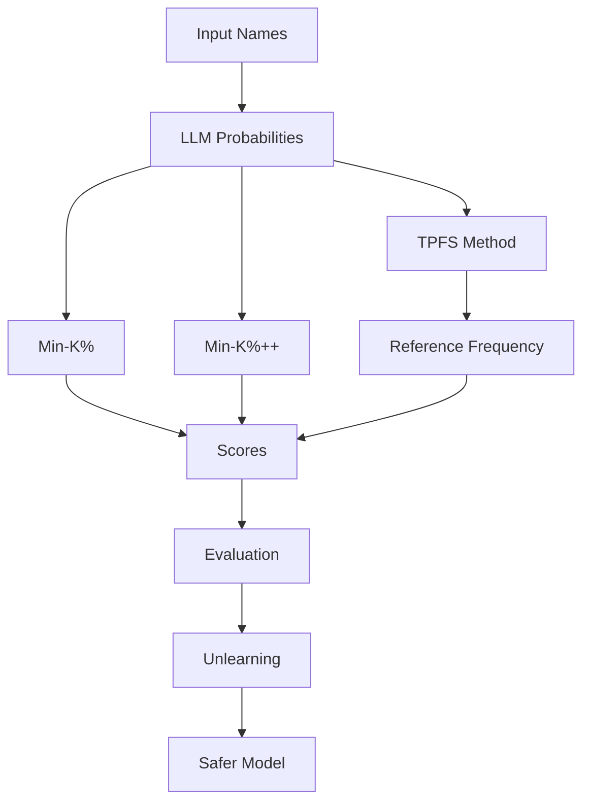

# 🔐 Unveiling PII in Pre-trained Models

### 🧠 Data Accountability & Privacy Risks in Large Language Models (LLMs)

<p align="center">
  
  
  
  
  
</p>

<p align="center">
  <b>🔍 PII Detection • ⚡ Novel TPFS • 🧹 Unlearning • ⚖️ Ethical AI</b>
</p>

---

## 🎯 Why This Project Matters

Large Language Models (LLMs) are trained on massive internet data.

⚠️ This creates a serious risk:

> Models may **memorize and leak Personally Identifiable Information (PII)**

This project investigates that risk and proposes solutions.

---

## 🚀 What This Project Does

* 🔍 Detects memorized PII in LLMs
* 🧠 Introduces a novel method (**TPFS**)
* 📊 Benchmarks against existing approaches
* 🧹 Applies machine unlearning to remove sensitive data
* ⚖️ Promotes privacy-aware AI development

---

## 🧠 Core Idea (Simple)

We compare:

* What the model **believes (probability)**
* What is **common in real language (frequency)**

👉 If something is **too confident but rare**, it may be memorized PII.

---

## 🏗️ System Overview



---

## 💡 TPFS (Our Contribution)

**Token Probability + Frequency Scoring**

```
TPFS = Average of log( Model Probability / Real Frequency )
```

### ✅ Why It Works Better

* Avoids bias from common words
* Considers full sequence (not just top tokens)
* More stable across models

---

## 📊 Results (Key Insights)

* 🥇 Min-K% works best at **low K (20%)**
* 📉 Performance drops as K increases
* ⚖️ **TPFS stays consistent and reliable**
* 🧠 Better reflects real-world language behavior

---

## 🧹 Machine Unlearning

### Approach

* Replace sensitive data → `email@example.com`
* Fine-tune model using **negative sampling**

### Result

| Stage  | AUC    |
| ------ | ------ |
| Before | 0.5790 |
| After  | 0.5077 |

✔ Reduced memorization
✔ Improved privacy safety

---

## 🛠️ Tech Stack

* PyTorch
* Hugging Face Transformers
* SpaCy (NER)
* Faker (synthetic data)
* Matplotlib

---

## 📂 Project Structure

```
project/
├── data/
├── experiments/
├── models/
├── tpfs/
├── unlearning/
├── results/
└── README.md
```

---

## 🌍 Impact

### 🔐 Privacy

Prevents unintended exposure of personal data

### ⚖️ Legal

Supports GDPR and data protection compliance

### 🧠 Ethical AI

Encourages responsible AI development

---

## ⚠️ Limitations

* TPFS depends on reference dataset size
* Limited testing on very large models
* Unlearning tested on smaller scale

---

## 🔮 Future Work

* 🚀 Scale to larger models (GPT-level)
* 📊 Improve TPFS with bigger datasets
* 🔍 Extend to financial & medical data
* ⚙️ Build automated privacy pipelines

---

## 👨‍💻 Authors

**Md. Abul Bashar Nirob**
**Adnan Bakth Mazmader**

🎓 North South University, Bangladesh

---

## 🎓 Supervisor

**Dr. Mohammad Ashrafuzzaman Khan**

---

## ⭐ Support This Work

If this project helped you:

* ⭐ Star the repo
* 🍴 Fork it
* 📢 Share it

---

## 🧠 Final Thought

> **Powerful AI must be accountable AI.**

This project is a step toward:

* 🔐 Privacy-aware systems
* ⚖️ Ethical AI
* 🧠 Responsible innovation
