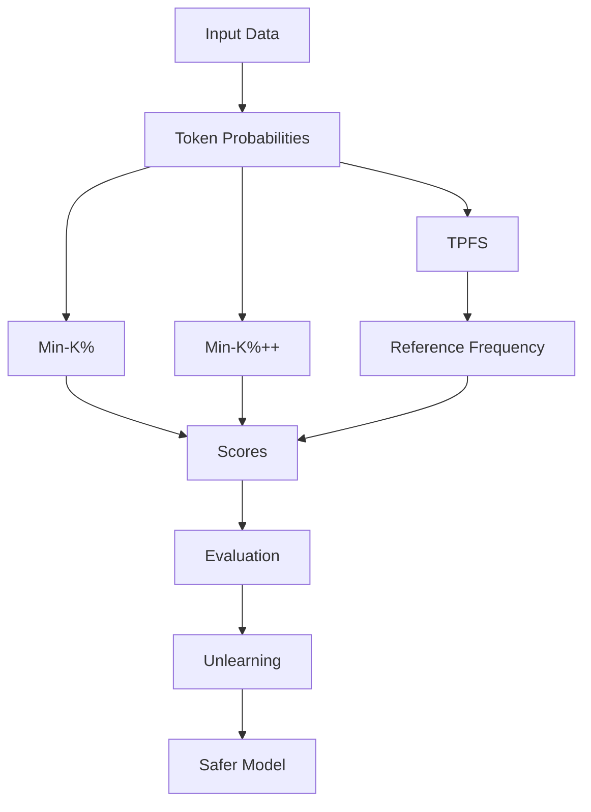

# 🔐 Unveiling PII in Pre-trained Models

### 🧠 Privacy Risks & Data Accountability in Large Language Models (LLMs)

<p align="center">
  
  
  
  
  
</p>

<p align="center">
  <b>🔍 PII Detection • ⚡ TPFS Innovation • 🧹 Machine Unlearning • ⚖️ Ethical AI</b>
</p>

---

## 🎯 Project Summary

Large Language Models (LLMs) are trained on massive web-scale datasets — often without strict filtering.

⚠️ This creates a hidden but critical problem:

> **Models can memorize and leak sensitive personal data (PII).**

This project investigates **how, why, and how to fix it.**

---

## 🚀 Key Contributions

### 🧠 1. Novel Detection Method — TPFS

* Combines **token probability + real-world frequency**
* Detects abnormal model confidence
* Reduces bias from common language tokens

---

### 📊 2. Comparative Evaluation

Benchmarked across multiple LLMs:

* GPT-2 Medium
* GPT-Neo (1.3B / 2.7B)
* OPT (1.3B / 2.7B)
* Pythia models

Compared:

* Min-K%
* Min-K%++
* **TPFS (proposed)**

---

### 🧹 3. Privacy Mitigation (Unlearning)

* Removes memorized PII
* Uses **negative sampling + fine-tuning**
* Demonstrates real reduction in data leakage

---

## 🧠 Core Insight

> If a model is **too confident about rare tokens**, it may have memorized them.

We detect this using:

TPFS = average log (model probability / real-world frequency)

---

## 🏗️ System Architecture



---

## 📸 Visual Results

### 📊 ROC Curve Analysis

* Evaluated using AUC scores
* Compared detection accuracy across models

### 🔍 Key Findings

* Min-K% performs best at **K = 20%**
* Performance drops at higher K
* **TPFS remains stable and robust**

---

## 🧹 Unlearning Impact

| Stage  | AUC Score |
| ------ | --------- |
| Before | 0.5790    |
| After  | 0.5077    |

✔ Reduced memorization
✔ Model loses ability to recall sensitive data

---

## 🛠️ Tech Stack

* 🔥 PyTorch
* 🤗 Hugging Face Transformers
* 🧠 SpaCy (NER)
* 🎭 Faker (synthetic data)
* 📊 Matplotlib

---

## 📂 Project Structure

```
project/
├── data/
├── experiments/
├── models/
├── tpfs/
├── unlearning/
├── results/
└── README.md
```

---

## 🌍 Real-World Impact

### 🔐 Privacy Protection

Prevents unintended leakage of personal data

### ⚖️ Legal Compliance

Aligns with GDPR & data protection policies

### 🧠 Ethical AI

Encourages responsible AI development

---

## ⚠️ Limitations

* TPFS depends on reference dataset size
* Limited large-scale testing
* Unlearning tested on smaller models

---

## 🔮 Future Work

* 🚀 Apply to larger models (GPT-scale)
* 📊 Improve TPFS with larger datasets
* 🔍 Extend to financial & medical PII
* ⚙️ Build automated privacy pipelines

---

## 👨‍💻 Authors

**Md. Abul Bashar Nirob**
**Adnan Bakth Mazmader**

🎓 North South University, Bangladesh

---

## 🎓 Supervisor

**Dr. Mohammad Ashrafuzzaman Khan**

---

## ⭐ Support

If this project impressed you:

* ⭐ Star the repository
* 🍴 Fork it
* 📢 Share it

---

## 🧠 Final Thought

> **“The future of AI is not just powerful — it must be responsible.”**

This project contributes toward:

* 🔐 Privacy-aware AI
* ⚖️ Ethical systems
* 🧠 Trustworthy machine learning
